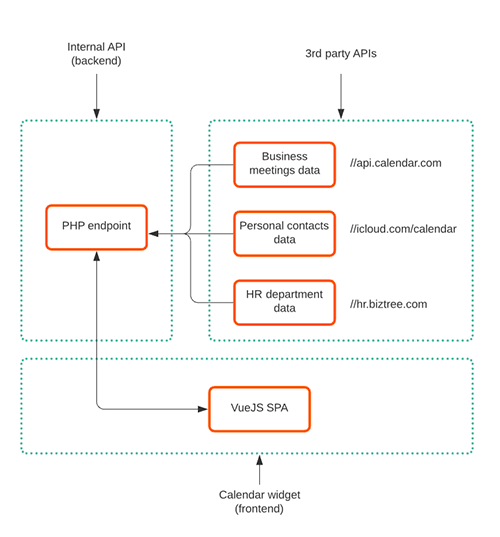
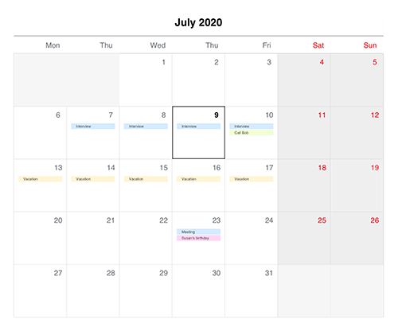

# Mini multi-platform project

### Purpose
Determine the ability to simultaneously handle front and back end coding tasks required in various projects. These tasks include (but not limited to) consuming 3rd party APIs on the server side, deploying internal APIs to be consumed by the front-end, fetching data by the browser from various sources, creating UI elements based on graphic mock-ups and prototypes using various CSS techniques, creating and deploying components using Javascript platforms.

### Objective
Build a calendar widget by aggregating on the server side (PHP) data fetched from different sources, serve it to the browser via XHR and assemble the UI to be consumed by the user using VueJS.

The design specs of the UI element look like below, but you will find a link to the file inspector lower in the Readme file

### Takeaways 

<ins>**DO NOT**</ins> focus on:
- Deploying servers
- Configuring projects
- Installing add-ons, packages, dependencies, 3rd party libraries
- Running error-free code
- Security aspects related to communication
- ... in other words do not focus on details not relevant to the global purpose

<ins>**DO**</ins> focus on:
- Structuring backend code in re-usable parts
- Creating easy to discover and maintainable internal APIs
- Modern CSS techniques to assemble layouts
- Re-usable and easy to understand BEM notations
- Segregated VueJS components with scalable inter-communication

### Key points to follow
On the backend part:
- Fetch data from 3rd party APIs and assemble it on the server side using PHP
- The endpoints used by PHP to fetch data from are fictitious, therefore you may organize the queries and responses as you see fit using a REST-ful approach
- Assemble data to be consumed by the frontend based on the final UI requirements and offer it using REST APIs. Structure parameters and responses as you see fit.
- Do not spend more than 20 minutes on consuming and deploying these APIs. The point is not to make a fully-functional API ecosystem in 20 mins, but to structure some snippets of code and apply core concepts of request/response in those 20 mins.

On the frontend part:
- Mockups are provided using Sketch Cloud, so you need to be able to interpret various properties and apply them when translating designs into CSS styling. The mockup can be found and inspected here: https://www.sketch.com/s/33e504de-15d9-42db-935a-70bfa24aa082/a/n3a5Zk#Inspector
- Create a set of inter-connected SINGLE FILE VueJS components including the template, script and SASS styling which in the end will compose the calendar widget.
- <ins>**NOTE**</ins>: VueJS is not a mandatory platform for this particular mini-project. You may use Svelte, React or Angular to prove your point and techniques but note that in the end at Biztree the platform of choice is (and will be) VueJS coupled with Nuxt. On the other end, jQuery will no longer be part of the stack used at Biztree.
- Do not spend more than 40-45 mins on this. The point is not to create a fully functional calendar widget, but to articulate modern CSS techniques, flexible components structure and usage of modern Javascript in fetching data from the internal APIs, assembling the UI, styling the elements, and connecting the components.

### Final notes
- Due to the short amount of time you should allocate to this mini-project (**do not spend more than an hour on it**), the final code will not be analyzed as whether it works or not on the browser but from ability to cover multiple topics, structure, technique and scalability perspective. Focus on the core skeleton which will define the widget functionality.
- In order to review your work we will do a screen sharing in which session you will walk us through your approach to accomplish the task.

### Good luck and keep inn touch!
